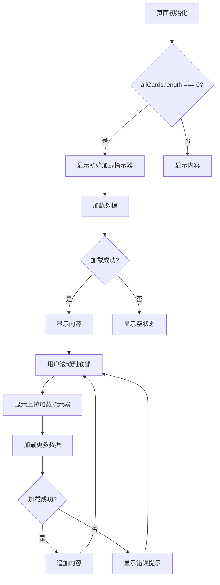

# 加载指示器重复问题修复

## 🎯 问题描述

第一次加载数据时出现了两个加载指示器：

1. **初始加载指示器**（在瀑布流容器内）- 显示"正在加载内容..."
2. **上拉加载指示器**（在容器外）- 显示"加载中..."

这导致用户界面混乱，用户体验不佳。

## 🔧 修复方案

### 修复前的逻辑

```vue
<!-- 初始加载指示器 -->
<div v-if="allCards.length === 0 && isLoadingMore">
    <!-- 加载动画 -->
</div>

<!-- 上拉加载指示器 -->
<div v-if="isLoadingMore">  <!-- ❌ 问题：第一次加载时也会显示 -->
    <!-- 加载动画 -->
</div>
```

### 修复后的逻辑

```vue
<!-- 初始加载指示器 -->
<div v-if="allCards.length === 0 && isLoadingMore">
    <div class="animate-spin rounded-full h-12 w-12 border-4 border-pink-500 border-t-transparent mb-4"></div>
    <span class="text-gray-500 text-sm">正在加载内容...</span>
</div>

<!-- 上拉加载指示器 - 只在有数据且正在加载更多时显示 -->
<div v-if="isLoadingMore && allCards.length > 0">  <!-- ✅ 修复：添加数据存在条件 -->
    <div class="animate-spin rounded-full h-6 w-6 border-b-2 border-pink-500"></div>
    <span class="ml-2 text-sm text-gray-500">加载中...</span>
</div>
```

## 📊 显示逻辑对比

### 不同状态下的指示器显示

| 状态               | allCards.length | isLoadingMore | 初始加载指示器 | 上拉加载指示器 |
| ------------------ | --------------- | ------------- | -------------- | -------------- |
| **首次加载中**     | 0               | true          | ✅ 显示        | ❌ 不显示      |
| **首次加载完成**   | >0              | false         | ❌ 不显示      | ❌ 不显示      |
| **上拉加载更多中** | >0              | true          | ❌ 不显示      | ✅ 显示        |
| **加载更多完成**   | >0              | false         | ❌ 不显示      | ❌ 不显示      |
| **加载失败**       | 0               | false         | ❌ 不显示      | ❌ 不显示      |

## 🎨 用户体验改进

### 修复前

```
首次访问页面
├── 显示页面骨架
├── 🔄 "正在加载内容..." (大指示器)
└── 🔄 "加载中..." (小指示器)  ← 重复且混乱
```

### 修复后

```
首次访问页面
├── 显示页面骨架
└── 🔄 "正在加载内容..." (大指示器)  ← 清晰单一

加载更多数据
├── 显示现有内容
└── 🔄 "加载中..." (小指示器)  ← 适合上拉加载
```

## 🚀 完整的状态管理

### 状态流转图



## 💡 其他相关修复

### API 调用类型修复

同时修复了 API 调用的类型错误：

```javascript
// 修复前
const { data: nextList } = await getList({...});
if (nextList && nextList.value?.data && nextList.value.data.length > 0) {
    // 类型错误
}

// 修复后
const nextList = await getList({...}) as any;
if (nextList && nextList.data && nextList.data.length > 0) {
    const newCards = transformApiData(nextList.data);
    // 类型正确
}
```

### 空状态处理

确保在加载失败时显示合适的空状态：

```vue
<!-- 空状态 -->
<div v-else-if="allCards.length === 0 && !isLoadingMore && !hasMore">
    <div class="text-6xl mb-4">📱</div>
    <span class="text-gray-500 text-lg mb-2">暂无内容</span>
    <span class="text-gray-400 text-sm">请稍后再试或检查网络连接</span>
</div>
```

## 🎯 总结

通过这次修复：

1. **消除了重复指示器**：第一次加载时只显示一个加载指示器
2. **改善了用户体验**：清晰的状态反馈，不再混乱
3. **修复了类型错误**：API 调用类型正确
4. **完善了状态管理**：各种状态下的 UI 表现一致

现在用户在首次访问页面时会看到清晰的单一加载指示器，在加载更多内容时会看到适合的上拉加载指示器，整体体验更加流畅和专业。
