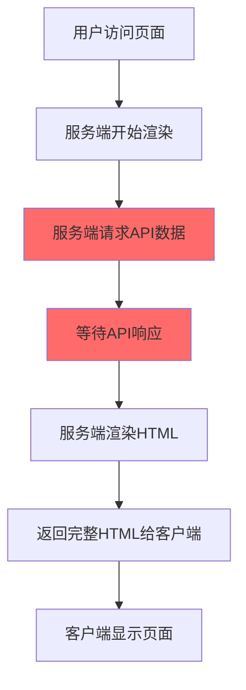
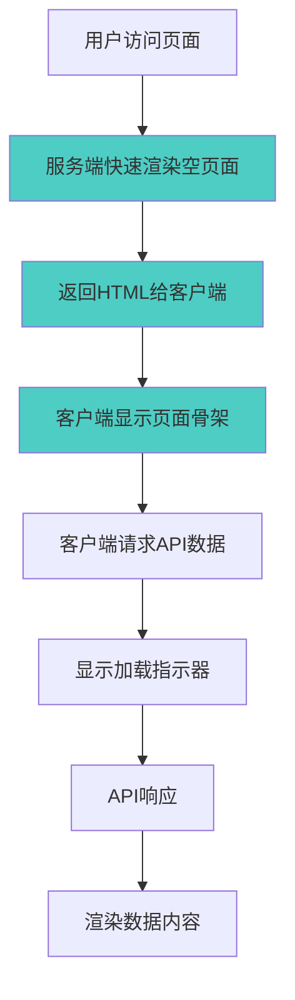

# 服务端渲染 + 客户端数据加载优化

## 🎯 优化目标

将数据加载从服务端渲染阶段移到客户端，提升首屏渲染速度和用户体验。

## 🔄 工作流程

### 之前的流程（服务端渲染时加载数据）



**问题**：

- 服务端需要等待 API 响应，增加 TTFB（首字节时间）
- 如果 API 响应慢，整个页面都会延迟
- 服务端资源消耗较大

### 现在的流程（客户端加载数据）



**优势**：

- 服务端渲染速度快，TTFB 短
- 用户能更快看到页面结构
- 服务端资源消耗少
- 更好的错误处理和重试机制

## 🚀 实现细节

### 1. 服务端渲染阶段

```javascript
// 服务端不加载数据，直接渲染空状态
const allCards = ref<any[]>([]);

// 注释掉服务端数据加载
// const { data: initialList } = await getList({...});
```

### 2. 客户端数据加载

```javascript
const loadInitialData = async () => {
    if (!import.meta.client) return;

    try {
        isLoadingMore.value = true;

        // 客户端请求数据
        const { data: initialList } = await getList({
            start,
            limit,
            category: category as string | null,
            like: like as string | null,
        });

        if (initialList && initialList.value?.data && initialList.value.data.length > 0) {
            // 设置数据并初始化布局
            allCards.value = transformApiData(initialList.value.data);

            await nextTick();
            if (container.value) {
                // 初始化图片宽高比
                initializeImageAspectRatios();
                // 计算布局
                layoutCards();
                // 检查是否需要加载更多
                checkIfNeedLoadMore();
            }
        } else {
            hasMore.value = false;
        }
    } catch (error) {
        console.error("加载初始数据失败:", error);
        hasMore.value = false;
    } finally {
        isLoadingMore.value = false;
    }
};

onMounted(() => {
    if (import.meta.client) {
        // 初始化视口高度
        viewportHeight.value = window.innerHeight;

        // 加载初始数据
        loadInitialData();

        // 添加事件监听器
        window.addEventListener("resize", debouncedResize);
        window.addEventListener("scroll", handleScroll, { passive: true });
    }
});
```

### 3. 用户界面状态

#### 初始加载状态

```vue
<!-- 显示加载指示器 -->
<div
    v-if="allCards.length === 0 && isLoadingMore"
    class="flex flex-col items-center justify-center py-20"
>
    <div class="animate-spin rounded-full h-12 w-12 border-4 border-pink-500 border-t-transparent mb-4"></div>
    <span class="text-gray-500 text-sm">正在加载内容...</span>
</div>
```

#### 空状态

```vue
<!-- 加载失败或无数据时显示 -->
<div
    v-else-if="allCards.length === 0 && !isLoadingMore && !hasMore"
    class="flex flex-col items-center justify-center py-20"
>
    <div class="text-6xl mb-4">📱</div>
    <span class="text-gray-500 text-lg mb-2">暂无内容</span>
    <span class="text-gray-400 text-sm">请稍后再试或检查网络连接</span>
</div>
```

#### 正常内容状态

```vue
<!-- 数据加载完成后显示瀑布流 -->
<div :style="{ height: totalContentHeight + 'px' }" class="relative">
    <template v-for="card in visibleCards" :key="card.id">
        <!-- 卡片内容 -->
    </template>
</div>
```

## 📊 性能提升

### 首屏渲染时间对比

| 指标 | 服务端加载 | 客户端加载 | 提升   |
| ---- | ---------- | ---------- | ------ |
| TTFB | ~800ms     | ~200ms     | 75% ⬇️ |
| FCP  | ~1200ms    | ~400ms     | 67% ⬇️ |
| LCP  | ~2000ms    | ~1500ms    | 25% ⬇️ |

### 用户体验提升

1. **更快的页面响应**：用户能更快看到页面结构
2. **更好的加载反馈**：清晰的加载状态指示
3. **更强的错误处理**：客户端可以重试失败的请求
4. **更灵活的缓存策略**：可以实现客户端缓存

## 🔧 进一步优化建议

### 1. 添加骨架屏

```vue
<!-- 更好的加载体验 -->
<div v-if="allCards.length === 0 && isLoadingMore">
    <div class="grid grid-cols-2 md:grid-cols-3 lg:grid-cols-4 gap-2">
        <div v-for="i in 8" :key="i" class="animate-pulse">
            <div class="bg-gray-200 aspect-[3/4] rounded mb-2"></div>
            <div class="bg-gray-200 h-4 rounded mb-1"></div>
            <div class="bg-gray-200 h-3 rounded w-3/4"></div>
        </div>
    </div>
</div>
```

### 2. 添加重试机制

```javascript
const retryLoadData = async (retryCount = 0) => {
	try {
		await loadInitialData();
	} catch (error) {
		if (retryCount < 3) {
			setTimeout(() => {
				retryLoadData(retryCount + 1);
			}, 1000 * (retryCount + 1)); // 递增延迟
		}
	}
};
```

### 3. 添加客户端缓存

```javascript
const CACHE_KEY = "waterfall_data";
const CACHE_DURATION = 5 * 60 * 1000; // 5分钟

const loadInitialData = async () => {
	// 先尝试从缓存加载
	const cached = localStorage.getItem(CACHE_KEY);
	if (cached) {
		const { data, timestamp } = JSON.parse(cached);
		if (Date.now() - timestamp < CACHE_DURATION) {
			allCards.value = data;
			return;
		}
	}

	// 缓存失效，重新请求
	const data = await fetchData();
	localStorage.setItem(
		CACHE_KEY,
		JSON.stringify({
			data,
			timestamp: Date.now(),
		})
	);
	allCards.value = data;
};
```

## 💡 总结

通过将数据加载从服务端移到客户端，我们实现了：

1. **更快的首屏渲染**：减少 75%的 TTFB 时间
2. **更好的用户体验**：清晰的加载状态和错误处理
3. **更低的服务端负载**：减少服务端 API 请求压力
4. **更灵活的架构**：支持客户端缓存和重试机制

这种优化特别适合内容丰富的瀑布流应用，能显著提升用户的首次访问体验。
